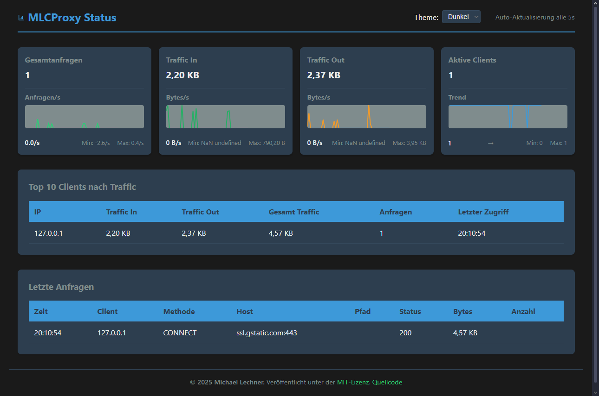

# MLCProxy

Ein robuster HTTP(S) Proxy-Server mit integrierter Statistik-Anzeige und Traffic-Monitoring.



## Motivation

Dieses Projekt entstand aus einem praktischen Problem: IoT-Sensoren im lokalen WLAN mussten mit einem Server kommunizieren, der nur über VPN erreichbar war. Das VPN war jedoch nur auf einem Laptop im gleichen WLAN-Netzwerk installiert und nicht für Routing konfiguriert.

Die Suche nach einer einfachen Proxy-Lösung, die plattformübergreifend (Windows/Mac/Linux) funktioniert, führte vor allem unter Windows zu unbefriedigenden Ergebnissen. Daher entstand die Idee, einen eigenen, schlanken Proxy-Server zu implementieren.

MLCProxy ist das Ergebnis dieser Bemühungen - ein einfacher, aber leistungsfähiger Proxy-Server, der nebenbei auch als Übungsprojekt zur Verbesserung meiner Go-Programmierkenntnisse diente.

## Features

- Vollständige HTTP und HTTPS Proxy-Unterstützung mit CONNECT-Handling
- Integrierte Echtzeit-Statistik-Anzeige über stats.local
- Live Traffic-Monitoring und -Analyse
- Konfigurierbarer Proxy-Port (Standard: 3128)
- Basic Authentication und IP-basierte Zugriffskontrolle
- Benutzerfreundliche Web-Oberfläche mit Fehler-Feedback
- Detaillierte Client-Statistiken und Byte-Tracking
- Automatische Aktualisierung der Anzeige
- Chrome DevTools-Kompatibilität
- Mehrsprachige Benutzeroberfläche (Deutsch/Englisch)

## Konfiguration

Die Konfiguration erfolgt über die `config.ini` Datei:

```ini
[server]
# Port auf dem der Proxy läuft
port = 3128

[paths]
# Basis-Pfad für statische Dateien
static_dir = static
# URL-Pfad für die Statistik-API
stats_path = /stat
# URL-Pfad für die API-Endpunkte
api_path = /api

[features]
# Hostname für die Statistik-Seite
stats_host = stats.local

[auth]
# Aktiviere Basic Auth (true/false)
enable_auth = true
# Benutzername:Passwort Paare (mehrere möglich)
credentials = admin:secret,user1:pass1

[security]
# Erlaube nur bestimmte Netzwerke (CIDR-Notation, kommagetrennt)
# IPv4 Beispiele: 
# - Einzelne IP: 192.168.1.1/32
# - Ganzes Subnetz: 192.168.1.0/24
# - Mehrere Netze: 192.168.1.0/24,10.0.0.0/8
# - Alles erlauben (IPv4): 0.0.0.0/0
# IPv6 Beispiele:
# - Localhost: ::1/128
# - Link-local: fe80::/10
# - Alles erlauben (IPv6): ::/0
allowed_networks = 127.0.0.1/32,192.168.0.0/16,::1/128,fe80::/10
```

## Installation und Build

Es gibt zwei Möglichkeiten, den Proxy zu erstellen:

### 1. Mit Build-Script (empfohlen)

#### Windows (PowerShell)

```powershell
.\build.ps1
```

#### macOS/Linux (Bash)

```bash
# Script ausführbar machen
chmod +x build.sh
# Build-Script ausführen
./build.sh
```

Dies erstellt einen `dist`-Ordner mit allen benötigten Dateien:

- mlcproxy.exe (Windows) oder mlcproxy (macOS/Linux)
- config.ini (Konfigurationsdatei)
- static/ (Verzeichnis mit Web-Oberfläche)
- LICENSE

### 2. Manueller Build

```powershell
# Als Administrator ausführen, wenn Berechtigungsprobleme auftreten
# Alternativ: PowerShell als Administrator starten

# Build-Funktion definieren
function Build-MLCProxy {
    try {
        # Sicherstellen, dass keine alte Instanz läuft
        Get-Process "mlcproxy" -ErrorAction SilentlyContinue | 
            Stop-Process -Force -ErrorAction SilentlyContinue
        
        # Warten bis Prozesse beendet sind
        Start-Sleep -Seconds 2
        
        # Alte Dateien entfernen
        if (Test-Path mlcproxy.exe) {
            Remove-Item -Path mlcproxy.exe -Force
        }
        
        # Binary erstellen
        Write-Host "Kompiliere mlcproxy..." -ForegroundColor Yellow
        & go build -o mlcproxy.exe cmd/proxy/main.go
        if (-not $?) { throw "Build fehlgeschlagen" }
        
        # Static-Ordner vorbereiten
        Write-Host "Kopiere statische Dateien..." -ForegroundColor Yellow
        if (Test-Path static) {
            Remove-Item -Path static -Recurse -Force
        }
        mkdir -Force static | Out-Null
        
        # Statische Dateien kopieren
        Copy-Item -Path "internal/stats/static/*" -Destination "static/" -Force -Recurse
        
        # Config erstellen falls nicht vorhanden
        if (-not (Test-Path "config.ini")) {
            Write-Host "Erstelle initiale config.ini..." -ForegroundColor Yellow
            Copy-Item "config.ini.example" "config.ini"
        }
        
        Write-Host "Build erfolgreich abgeschlossen!" -ForegroundColor Green
        return $true
    }
    catch {
        Write-Host "Build fehlgeschlagen: $_" -ForegroundColor Red
        return $false
    }
}

# Build ausführen
Build-MLCProxy
```

Wenn Sie Berechtigungsprobleme haben, führen Sie PowerShell als Administrator aus und versuchen Sie es erneut.

## Verwendung

Starten Sie den Proxy mit dem Standardport (3128):

```powershell
.\mlcproxy.exe
```

Oder geben Sie einen benutzerdefinierten Port an:

```powershell
.\mlcproxy.exe -port 8080
```

Die Statistik-Seite ist auf zwei Arten erreichbar:

1. `http://stats.local` (erfordert Proxy-Konfiguration)
2. `http://localhost:3128/stat` (direkt)

## Proxy-Konfiguration

### Windows

1. Systemweite Konfiguration:
   - Öffnen Sie Windows-Einstellungen > Netzwerk & Internet > Proxy
   - Aktivieren Sie "Manuelle Proxy-Einrichtung"
   - Setzen Sie "Proxy-IP-Adresse" auf: `127.0.0.1`
   - Setzen Sie "Port" auf: `3128`
   - Optional: Fügen Sie `stats.local` zu "Proxy nicht für folgende Adressen verwenden" hinzu

2. Konfiguration über die Kommandozeile:

   ```powershell
   # Proxy setzen
   netsh winhttp set proxy proxy-server="127.0.0.1:3128"

   # Proxy entfernen
   netsh winhttp reset proxy
   ```

### macOS

1. Systemweite Konfiguration:
   - Öffnen Sie Systemeinstellungen > Netzwerk > Erweitert > Proxies
   - Aktivieren Sie "Web Proxy (HTTP)" und "Sicherer Web Proxy (HTTPS)"
   - Setzen Sie "Web Proxy Server" auf: `127.0.0.1`
   - Setzen Sie "Port" auf: `3128`
   - Optional: Fügen Sie `stats.local` zu "Proxy-Einstellungen umgehen für diese Hosts & Domains" hinzu

2. Konfiguration über das Terminal:

   ```bash
   # Proxy setzen
   export http_proxy="http://127.0.0.1:3128"
   export https_proxy="http://127.0.0.1:3128"

   # Proxy entfernen
   unset http_proxy https_proxy
   ```

### Browser-Erweiterungen

Für einfaches Umschalten des Proxys empfehlen wir:

1. **Proxy Switcher and Manager** (Chrome/Edge/Opera)
   - [Chrome Web Store Link](https://chrome.google.com/webstore/detail/proxy-switcher-and-manager/onnfghpihccifgojkpnnncpagjcdbjod)
   - Funktionen:
     - Schnelles Proxy-Umschalten
     - Mehrere Proxy-Profile
     - Automatisches Umschalten basierend auf Regeln
     - Integration mit System-Proxy

2. **FoxyProxy** (Firefox)
   - [Firefox Add-ons Link](https://addons.mozilla.org/de/firefox/addon/foxyproxy-standard/)
   - Funktionen:
     - Musterbasiertes Proxy-Umschalten
     - Mehrere Proxy-Konfigurationen
     - Import/Export von Einstellungen

Konfigurieren Sie diese Erweiterungen mit:

- Proxy Host: `127.0.0.1` oder `localhost`
- Port: `3128`
- Typ: HTTP/HTTPS Proxy

## Curl-Beispiele

HTTP-Test:

```powershell
# PowerShell
curl.exe -v --proxy http://localhost:3128 http://httpbin.org/get

# Alternativ mit Invoke-WebRequest
Invoke-WebRequest -Proxy "http://localhost:3128" -Uri "http://httpbin.org/get" -Verbose
```

HTTPS-Test:

```powershell
# PowerShell
curl.exe -v --proxy http://localhost:3128 https://httpbin.org/get

# Alternativ mit Invoke-WebRequest
Invoke-WebRequest -Proxy "http://localhost:3128" -Uri "https://httpbin.org/get" -Verbose
```

Statistik abrufen:

```powershell
# PowerShell - Direkt
curl.exe http://localhost:3128/stat
# oder
Invoke-WebRequest -Uri "http://localhost:3128/stat"

# PowerShell - Über Proxy (stats.local)
curl.exe --proxy http://localhost:3128 http://stats.local
# oder
Invoke-WebRequest -Proxy "http://localhost:3128" -Uri "http://stats.local"
```

## Hinweis für PowerShell-Benutzer

In PowerShell werden Befehle mit `;` statt `&&` verkettet. Beispiel:

```powershell
go build -o mlcproxy.exe cmd/proxy/main.go; .\mlcproxy.exe
```

## Lizenz

Dieses Projekt steht unter der MIT-Lizenz - siehe die [LICENSE](LICENSE) Datei für Details.

## Danksagungen

- Dank an alle Mitwirkenden
- Icons von [Material Design Icons](https://material.io/icons/)
- Entwickelt mit Go und modernen Web-Technologien

## Autor

- **Michael Lechner** - *Initiale Arbeit* - [MLCProxy](https://github.com/mlechner911/mlcproxy)

## Sprachen

- [English Version (Englische Version)](README.md)
