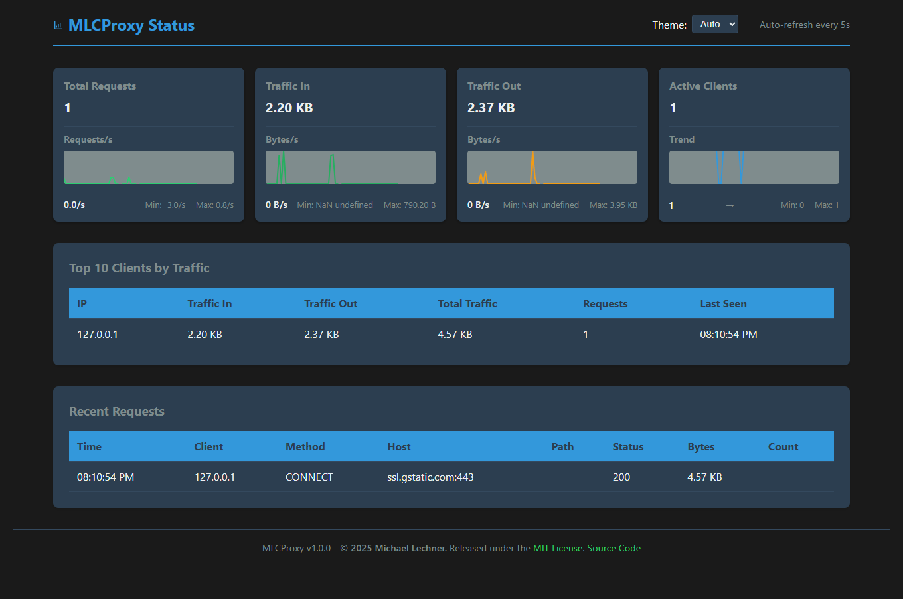

# MLCProxy

A robust HTTP(S) proxy server with integrated statistics display and traffic monitoring.



## Motivation

This project emerged from a practical problem: IoT sensors in a local WiFi network needed to communicate with a server that was only accessible via VPN. However, the VPN was only installed on a laptop in the same WiFi network and wasn't configured for routing.

The search for a simple proxy solution that works cross-platform (Windows/Mac/Linux) led to unsatisfactory results, especially on Windows. This sparked the idea to implement a custom, lightweight proxy server.

MLCProxy is the result of these efforts - a simple yet powerful proxy server that also served as a practice project to improve my Go programming skills.

## Features

- Complete HTTP and HTTPS proxy support with CONNECT handling
- Integrated real-time statistics display via stats.local
- Live traffic monitoring and analysis
- Configurable proxy port (default: 3128)
- Basic Authentication and IP-based access control
- User-friendly web interface with error feedback
- Detailed client statistics and byte tracking
- Automatic display updates
- Chrome DevTools compatibility
- Multilingual interface (English/German)

## Configuration

The configuration is done via the `config.ini` file:

```ini
[server]
# Port on which the proxy runs
port = 3128

[paths]
# Base path for static files
static_dir = static
# URL path for statistics API
stats_path = /stat
# URL path for API endpoints
api_path = /api

[features]
# Hostname for statistics page
stats_host = stats.local

[auth]
# Enable Basic Auth (true/false)
enable_auth = true
# Username:password pairs (multiple possible)
credentials = admin:secret,user1:pass1

[security]
# Allow only specific networks (CIDR notation, comma-separated)
# IPv4 Examples: 
# - Single IP: 192.168.1.1/32
# - Full subnet: 192.168.1.0/24
# - Multiple networks: 192.168.1.0/24,10.0.0.0/8
# - Allow all IPv4: 0.0.0.0/0
# IPv6 Examples:
# - Localhost: ::1/128
# - Link-local: fe80::/10
# - All IPv6: ::/0
allowed_networks = 127.0.0.1/32,192.168.0.0/16,::1/128,fe80::/10
```

## Installation and Build

There are two ways to build the proxy:

### 1. Using Build Script (recommended)

#### Windows (PowerShell)
```powershell
.\build.ps1
```

#### macOS/Linux (Bash)
```bash
# Make script executable
chmod +x build.sh
# Run build script
./build.sh
```

This creates a `dist` folder with all required files:

- mlcproxy.exe (Windows) or mlcproxy (macOS/Linux)
- config.ini (configuration file)
- static/ (directory with web interface)
- LICENSE

### 2. Manual Build

```powershell
# Build binary
go build -o mlcproxy.exe cmd/proxy/main.go

# Create static folder if it doesn't exist
mkdir -Force static

# Copy static files
Copy-Item -Path "internal/stats/static/*" -Destination "static/" -Force -Recurse

# Copy config.ini (if it doesn't exist)
if (-not (Test-Path "config.ini")) {
    Copy-Item "config.ini.example" "config.ini"
}
```

## Usage

Start the proxy with the default port (3128):

```powershell
.\mlcproxy.exe
```

Or specify a custom port:

```powershell
.\mlcproxy.exe -port 8080
```

The statistics page can be accessed in two ways:

1. `http://stats.local` (requires proxy configuration)
2. `http://localhost:3128/stat` (direct)

## Proxy Configuration

### Windows

1. System-wide configuration:
   - Open Windows Settings > Network & Internet > Proxy
   - Enable "Manual proxy setup"
   - Set "Proxy IP address" to: `127.0.0.1`
   - Set "Port" to: `3128`
   - Optional: Add `stats.local` to "Don't use proxy server for these addresses"

2. Install as Windows Service:
   ```powershell
   # Run PowerShell as Administrator
   .\install-service.ps1
   ```
   This will:
   - Create a service named "MLCProxy"
   - Configure it to start automatically
   - Set proper permissions
   - Start the service immediately

3. Command line configuration:
   ```powershell
   # Set proxy
   netsh winhttp set proxy proxy-server="127.0.0.1:3128"

   # Remove proxy
   netsh winhttp reset proxy
   ```

### macOS

1. System-wide configuration:
   - Open System Preferences > Network > Advanced > Proxies
   - Check "Web Proxy (HTTP)" and "Secure Web Proxy (HTTPS)"
   - Set "Web Proxy Server" to: `127.0.0.1`
   - Set "Port" to: `3128`
   - Optional: Add `stats.local` to "Bypass proxy settings for these Hosts & Domains"

2. Command line configuration:
   ```bash
   # Set proxy
   export http_proxy="http://127.0.0.1:3128"
   export https_proxy="http://127.0.0.1:3128"

   # Remove proxy
   unset http_proxy https_proxy
   ```

### Browser Extensions

For easy proxy switching, we recommend:

1. **Proxy Switcher and Manager** (Chrome/Edge/Opera)
   - [Chrome Web Store Link](https://chrome.google.com/webstore/detail/proxy-switcher-and-manager/onnfghpihccifgojkpnnncpagjcdbjod)
   - Features:
     - Quick proxy switching
     - Multiple proxy profiles
     - Auto-switch based on rules
     - System proxy integration

2. **FoxyProxy** (Firefox)
   - [Firefox Add-ons Link](https://addons.mozilla.org/en-US/firefox/addon/foxyproxy-standard/)
   - Features:
     - Pattern-based proxy switching
     - Multiple proxy configurations
     - Import/export settings

Configure these extensions with:
- Proxy Host: `127.0.0.1` or `localhost`
- Port: `3128`
- Type: HTTP/HTTPS Proxy

## Curl Examples

HTTP test:

```powershell
# PowerShell
curl.exe -v --proxy http://localhost:3128 http://httpbin.org/get

# Alternative using Invoke-WebRequest
Invoke-WebRequest -Proxy "http://localhost:3128" -Uri "http://httpbin.org/get" -Verbose
```

HTTPS test:

```powershell
# PowerShell
curl.exe -v --proxy http://localhost:3128 https://httpbin.org/get

# Alternative using Invoke-WebRequest
Invoke-WebRequest -Proxy "http://localhost:3128" -Uri "https://httpbin.org/get" -Verbose
```

Get statistics:

```powershell
# PowerShell - Direct
curl.exe http://localhost:3128/stat
# or
Invoke-WebRequest -Uri "http://localhost:3128/stat"

# PowerShell - Via Proxy (stats.local)
curl.exe --proxy http://localhost:3128 http://stats.local
# or
Invoke-WebRequest -Proxy "http://localhost:3128" -Uri "http://stats.local"
```

## Note for PowerShell Users

In PowerShell, commands are chained using `;` instead of `&&`. Example:

```powershell
go build -o mlcproxy.exe cmd/proxy/main.go; .\mlcproxy.exe
```

## License

This project is licensed under the MIT License - see the [LICENSE](LICENSE) file for details.

## Acknowledgments

- Thanks to all contributors
- Icons from [Material Design Icons](https://material.io/icons/)
- Built with Go and modern web technologies

## Author

- **Michael Lechner** - *Initial work* - [MLCProxy](https://github.com/mlechner911/mlcproxy)

## Languages

- [Deutsche Version (German Version)](README.de.md)
